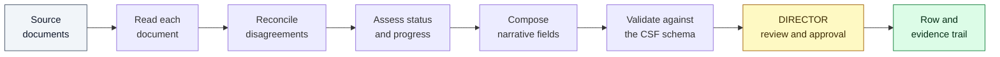

# CSF Quarterly Update Drafter

**Personal Layer — Workstream A**

Prepares a director's quarterly CSF objective update from their own Microsoft 365
material, cites every proposed value back to the document it came from, and
presents the result for review, correction and approval.

The tool proposes. The director decides. It does not write to any system of record.

<table>
<tr><td width="22%"><b>Interface</b></td><td>Web application, with an equivalent command-line runner</td></tr>
<tr><td><b>Inputs</b></td><td>Markdown or plain-text documents: an objective record, the previous quarter's submitted update, and any number of evidence documents</td></tr>
<tr><td><b>Outputs</b></td><td>A proposed <code>Quarterly_Updates</code> row as JSON or CSV, plus a complete evidence trail</td></tr>
<tr><td><b>Requirements</b></td><td>Python 3.10 or later, and an Anthropic API key</td></tr>
<tr><td><b>Deployment</b></td><td>Local workstation, or a single cloud service</td></tr>
<tr><td><b>Time to first draft</b></td><td>Under ten minutes from a clean checkout</td></tr>
</table>

---

## Contents

| Section | |
|:--|:--|
| [1. Overview](#overview) | The problem addressed, and what changes |
| [2. Quick start](#quickstart) | Four steps, under ten minutes |
| [3. Capabilities](#capabilities) | What the product does |
| [4. Verification](#verification) | Confirmed behaviour on unseen evidence |
| [5. Application screens](#screens) | Where each task is performed |
| [6. Configuration](#configuration) | Settings and their defaults |
| [7. Working with your own evidence](#evidence) | Bringing in real material |
| [8. Operating notes](#operating) | Command line, deployment, data handling |
| [9. Frequently asked questions](#faq) | Common questions from reviewers |

---

<a id="overview"></a>

## 1. Overview

Quarterly CSF reporting asks a director to summarise three months of activity
into a small number of governed fields, against a submission deadline. The
material needed to do this accurately is spread across email, chat, meeting notes
and reports, and is rarely revisited at the point of writing. The result is an
update written substantially from memory, with no record of what it was based on.

This tool addresses that directly.

<table>
<tr>
<th width="50%">Current practice</th>
<th width="50%">With this tool</th>
</tr>
<tr>
<td valign="top">

**Written at the deadline, from recall**<br>
An hour spent reconstructing the quarter from Outlook and Teams.

**No traceable basis**<br>
A figure questioned in the next review cycle cannot be substantiated.

**Late changes are missed**<br>
A commitment revised in August remains reported as it stood in May.

**The previous quarter is carried forward**<br>
Restating a position is significantly cheaper than revising it.

</td>
<td valign="top">

**Reviewed, not composed**<br>
A complete draft is already prepared; the director reads, corrects and approves.

**Every value carries its source**<br>
Selecting any cited value opens the originating document with the exact lines marked.

**Disagreements are surfaced**<br>
Where a later document contradicts an earlier one, both are presented side by side before approval.

**Each quarter is assessed on its own evidence**<br>
The previous position is shown for comparison, not inherited.

</td>
</tr>
</table>

### Measured outcomes of a single run

| | |
|:--|:--|
| Governed fields drafted | 6 — traffic light, progress percentage, key success, key challenge, support needed, support from |
| Citation coverage | Every significant field, resolved to specific lines in a named document |
| Elapsed time | Approximately one minute, reported stage by stage |
| Application screens | 9, covering intake, review, evidence inspection, audit and export |
| Export formats | 3 — row as JSON, row as CSV, evidence trail as a document |
| Writes to a system of record | None. No such capability exists in the product |

---

<a id="quickstart"></a>

## 2. Quick start

A colleague with Python installed can reach a complete, cited draft in under ten
minutes. All commands are run from the `IRLI-man-02/` directory.

| Step | Task | Approximate time |
|:--|:--|:--|
| 1 | Create an environment and install dependencies | 3 minutes |
| 2 | Provide an Anthropic API key | 1 minute |
| 3 | Start the application | 10 seconds |
| 4 | Load the sample evidence pack and run | 2 minutes |

### Step 1 — Install

<table>
<tr>
<td width="50%" valign="top">
<b>Windows (PowerShell)</b>
<pre><code>python -m venv .venv
.venv\Scripts\pip install -r requirements.txt</code></pre>
</td>
<td width="50%" valign="top">
<b>macOS and Linux</b>
<pre><code>python3 -m venv .venv
.venv/bin/pip install -r requirements.txt</code></pre>
</td>
</tr>
</table>

Requires Python 3.10 or later. All dependency versions are pinned, so the
installed environment matches the environment the product was built against.

### Step 2 — Provide an API key

<table>
<tr>
<td width="50%" valign="top">
<b>Option A — in the application</b><br><br>
Start the application (step 3), open <b>Settings</b> in the sidebar and enter the
key. It is validated against the service immediately, so an incorrect or
unauthorised key is reported at the point of entry rather than part-way through a
run.
<br><br>
The key is held by the running process only and is discarded when the application
stops. The same dialog selects which model performs the reasoning and which
performs the reading.
</td>
<td width="50%" valign="top">
<b>Option B — in a configuration file</b>
<pre><code>cp .env.example .env</code></pre>
Set the key in the copied file:
<pre><code>ANTHROPIC_API_KEY=sk-ant-...</code></pre>
The file is read at start-up, so restart the application after editing it.
</td>
</tr>
</table>

### Step 3 — Start the application

```bash
.venv/bin/uvicorn app.main:app --reload
```

The application is served at **http://127.0.0.1:8000**.

On Windows, use `.venv\Scripts\uvicorn app.main:app --reload`, or activate the
environment once with `.venv\Scripts\Activate.ps1` and omit the path prefix
throughout.

### Step 4 — Produce a draft

| | |
|:--|:--|
| **a** | Select **New run** in the sidebar. |
| **b** | Select **Load the demo pack**. This provides an objective record, the previous quarter's submitted update, and five evidence documents: two emails, a Teams conversation, a meeting note, and a calendar and report excerpt. |
| **c** | Confirm the quarter reads `2026-Q3`. An optional as-of date may be set, against which any days-remaining figures are calculated. |
| **d** | Select **Run the pipeline**. Each stage reports as it completes; the run takes approximately one minute. |
| **e** | The review screen opens, containing the draft, the contradictions found in the evidence, the questions left unresolved, and a citation on every significant value. |

### Confirming a successful installation

The review screen should present all of the following.

| Element | Description |
|:--|:--|
| Status and progress | A traffic light and percentage, with the previous quarter's values alongside for comparison |
| **Needs your attention** | Contradictions and unresolved questions, presented above the draft |
| Citations | A citation on every significant value; selecting one opens the source document with the cited lines marked |
| Confidence indicator | A statement of how many independent documents support each value |
| Editable values | Every field editable, including the traffic light; changes to assessed values record a reason |
| **Approve and export** | Available once every field has been acknowledged |

---

<a id="capabilities"></a>

## 3. Capabilities

### Review and assurance

<table>
<tr>
<td width="50%" valign="top">
<b>Needs your attention</b><br><br>
The first section of the review screen, ahead of the draft itself. Two groups are
maintained: material <i>contradicted since it was written</i>, and material
<i>raised and never settled</i>. Each entry carries a severity and the basis for
that severity.
</td>
<td width="50%" valign="top">
<b>Contradictions presented in full</b><br><br>
Superseded and superseding statements are shown side by side, quoted, with a
statement of how the conflict was resolved. The director sees the disagreement
before approval rather than after publication.
</td>
</tr>
<tr>
<td valign="top">
<b>Unresolved questions retained</b><br><br>
Where a question was raised and never answered, it is listed together with what
it leaves unverified, and recorded as unknown rather than treated as complete.
</td>
<td valign="top">
<b>Source inspection</b><br><br>
Selecting a citation opens the originating document beside the draft, with the
cited lines marked and numbered against the file, so a value can be checked
without leaving the field.
</td>
</tr>
<tr>
<td valign="top">
<b>Confidence indication</b><br><br>
Each value carries an indication of how many independent documents support it, so
a value corroborated by three sources is distinguishable from one resting on a
single message.
</td>
<td valign="top">
<b>Fields left empty where evidence is absent</b><br><br>
Where the evidence does not support a field, it is returned empty and referred to
the director rather than completed on a best guess.
</td>
</tr>
</table>

### Director control

<table>
<tr>
<td width="50%" valign="top">
<b>Full editability</b><br><br>
Every value is editable, including the traffic light. Changing an assessed value
records a reason, which is retained with the row. The approved row is the
director's position.
</td>
<td width="50%" valign="top">
<b>Acknowledgement before export</b><br><br>
Export becomes available only once every field has been acknowledged or amended,
with progress against that requirement shown at all times.
</td>
</tr>
<tr>
<td valign="top">
<b>Resumable review</b><br><br>
A draft under review is preserved. The session can be closed and resumed later
with all findings and acknowledgements intact.
</td>
<td valign="top">
<b>No submission path</b><br><br>
Approval prepares files. Submission remains a deliberate act performed by a
person in the CSF Form.
</td>
</tr>
</table>

### Intake, reporting and audit

<table>
<tr>
<td width="50%" valign="top">
<b>Evidence intake</b><br><br>
Documents may be dragged onto the page, pasted in, edited in place, removed, or
relabelled as to what they represent. The objective record and its success
measure are editable on the same screen.
</td>
<td width="50%" valign="top">
<b>Progress reporting</b><br><br>
Each stage of a run reports as it completes, so the elapsed time is accounted for
rather than unexplained.
</td>
</tr>
<tr>
<td valign="top">
<b>Snapshot and portfolio views</b><br><br>
A per-draft snapshot shows movement against the previous quarter. A portfolio
dashboard reports across all runs: traffic-light distribution, average progress,
and how many drafts are in progress, in review or approved.
</td>
<td valign="top">
<b>Evidence trail</b><br><br>
Every stage, every model call with its usage and duration, and every director
edit — together with the evidence on screen at the time — is recorded as it
happens. The record is append-only, held on disk, and survives a restart.
</td>
</tr>
</table>

### Processing sequence



The sequence halts at director review and cannot continue unattended. No stage
after that point executes without a person initiating it.

Each document is read independently, so a detail reported by only one source is
not averaged away against the others; where sources disagree, the disagreement is
recorded as a finding. Citations are resolved against the exact text supplied to
the model, so every quotation presented to the director is verbatim from their
own document.

---

<a id="verification"></a>

## 4. Verification

Two properties were confirmed by direct test rather than by inspection.

### 4.1 Independence from the supplied evidence pack

**Purpose.** To establish that the workflow is not coupled to the characteristics
of the sample material, and can be applied to any objective without modification.

**Method.** A second evidence pack was constructed to differ from the sample on
every available dimension:

| Dimension | Sample pack | Verification pack |
|:--|:--|:--|
| Function and subject | Health — disease surveillance agreements | Finance — grants ledger migration |
| Region | Eastern and Southern Africa | South-East Asia |
| Personnel | Distinct set | Distinct set |
| File naming | Numbered prefixes | Descriptive names, no prefixes |
| Date formats in headings | One format | Three different formats |
| Conversation layout | One convention | A different convention |

The application was directed at the new folder with a single argument. No code
was modified and no configuration was changed.

**Result.** The run completed successfully and returned a row valid against the
CSF schema.

| Observation | Outcome |
|:--|:--|
| Documents ingested | 3 of 3, each correctly identified by type |
| Date formats interpreted | 3 of 3, all normalised correctly |
| Cited claims produced | 18 |
| Contradictions identified | 5, each between the earlier plan and the later reported position |
| Previous-quarter position | Not inherited. The prior submission was Green at 55 per cent; the proposal was Amber at 25 per cent, consistent with the new evidence |
| Fields without supporting evidence | Returned empty and referred to the director |

**Conclusion.** No characteristic of the sample pack is embedded in the product —
neither filenames, personnel, locations, date conventions nor subject matter.

### 4.2 The export carries its evidence

**Purpose.** To establish that an approved row can be substantiated later by
someone who was not present when it was prepared.

**Result.** Approval produces three artefacts, offered together on the export
screen:

| Artefact | Contents |
|:--|:--|
| Row as JSON | The governed field values, in the schema's shape |
| Row as CSV | The same values in SharePoint column order |
| Evidence trail | The supporting record, as a document |

The evidence trail states which documents were read and how they were classified;
every processing stage with its timing; every model call with its usage and
duration; every director edit, including the evidence displayed at the time; and
each originally proposed value beside the value finally approved. The record is
append-only, so history is added to and never rewritten.

---

<a id="screens"></a>

## 5. Application screens

| Screen | Purpose |
|:--|:--|
| **New run** | Provide the objective record, the previous quarter's update and the evidence; set the quarter and as-of date. The starting point for a new draft. |
| **Runs** | All drafts prepared to date, most recent first, with current status. |
| **Review draft** | The principal screen: the draft, its contradictions, its unresolved questions, and a citation on every significant value. |
| **Snapshot** | The current draft against the previous quarter's submitted position. |
| **Evidence** | Any source document, with cited lines marked and numbered against the file. |
| **Run audit** | For one run: what was read, what it cost, every edit and correction, and the draft's revision history. |
| **Export** | The approved row as JSON or CSV, and the evidence trail. |
| **Dashboard** | Across all runs: traffic-light distribution, average progress, and drafts by status. |
| **Audit trail** | Across all runs: every stage, every model call and every override. |

---

<a id="configuration"></a>

## 6. Configuration

Settings may be supplied through the in-application **Settings** dialog or the
`.env` file. Only the API key is required.

| Setting | Default | Effect |
|:--|:--|:--|
| API key | — | Required. No offline mode is provided. |
| Reasoning model | Claude Opus 4.6 | Assesses status and composes the narrative fields. Selected from a list of current models. |
| Reading model | Claude Sonnet 4.6 | Reads the source documents and cites them. |
| Quarter | `2026-Q3` | The quarter being reported. Requested rather than inferred, since a late submission concerns the preceding quarter. |
| As-of date | Current date | The date from which days-remaining figures are calculated, recorded on the run so a draft reviewed later retains the arithmetic it was written against. |
| Evidence directory | `data` | The directory documents are read from. |

Values set in the Settings dialog apply for the lifetime of the running process
and take precedence over the configuration file.

---

<a id="evidence"></a>

## 7. Working with your own evidence

The most direct method is to add files on the **New run** screen and label each
one as the objective record, the previous quarter's update, or evidence.

Where a directory is preferred, one directory constitutes the entire input:

```
your-folder/
  objective.md        the objective being reported on
  prior_update.md     the previous quarter's submitted update (optional)
  evidence/*.md       any number of documents, any filenames
```

Direct the application at it using `--data-dir` on the command line, or
`DATA_DIR` in the configuration file. Documents are ordered by the date in their
heading, with undated documents placed last.

In production this material would be delivered through the organisation's
approved Microsoft 365 connectors. The product reads whatever those connectors
deposit; the connector layer itself is out of scope.

---

<a id="operating"></a>

## 8. Operating notes

<details>
<summary><b>Running without the web interface</b></summary>

<br>

A command-line runner produces the same draft and prints it, which is suitable
for a scheduled job or a quick check:

```bash
.venv/bin/python -m app.cli --data-dir data --quarter 2026-Q3
```

`--json` returns the row alone. `--data-dir` accepts any directory. The runner
stops at the same review point: it reports the proposed row and cannot approve or
submit it.

</details>

<details>
<summary><b>Deploying as a service</b></summary>

<br>

`render.yaml` describes a working single-service deployment: a pinned Python
version, the API key held as a protected secret, and a persistent volume so
drafts and evidence trails survive a restart.

```bash
uvicorn app.main:app --host 0.0.0.0 --port $PORT
```

The product is designed as a single-user tool and provides no authentication of
its own. It should be placed behind the organisation's existing access controls
before being exposed.

</details>

<details>
<summary><b>Data handling</b></summary>

<br>

The application runs on the operator's own workstation or server. Source
documents are read from a directory under the operator's control, and drafts,
audit records and exports are written back to the same machine. The only external
request is to the Anthropic API, to perform the reading and drafting.

No prompt or response body is retained in the evidence trail; the trail records
what occurred, not a second copy of the source material.

</details>

<details>
<summary><b>Cost reporting</b></summary>

<br>

Usage is reported per run and across all runs. The audit screens list every model
call with its usage and duration, so the cost of a draft is a recorded figure
rather than an estimate.

</details>

---

<a id="faq"></a>

## 9. Frequently asked questions

<details>
<summary><b>Can the tool submit an update, whether intentionally or in error?</b></summary>

<br>

No. There is no integration with any system of record anywhere in the product —
it is not disabled or permission-gated, it is not implemented. Approval writes
files to disk. Submission is performed by a person, in the CSF Form.

</details>

<details>
<summary><b>What happens when the director disagrees with the draft?</b></summary>

<br>

They amend it, and their version is the one that is exported. Every field is
editable, including the traffic light. Amending an assessed value records a
reason alongside the change, so the row that reaches submission is the director's
own position with its basis stated.

</details>

<details>
<summary><b>How can a figure be shown to be substantiated rather than invented?</b></summary>

<br>

By opening it. Selecting a cited value displays the source document beside the
draft with the cited lines marked and numbered against the file, so the original
sentence is read rather than a paraphrase of it. Where the evidence supports
nothing, the field is returned empty and referred to the director.

</details>

<details>
<summary><b>Will it work on our objectives, or only on the sample?</b></summary>

<br>

Any objective. This was confirmed by test against a second, entirely unrelated
evidence pack — a different function, region, personnel, file-naming convention,
three different date formats and a different conversation layout — with no code
change and no configuration. The run identified each document correctly, produced
18 cited claims, identified 5 genuine contradictions, and returned a valid row
that did not repeat the previous quarter's position. Section 4.1 records the test
in full.

</details>

<details>
<summary><b>What can a reviewer examine in a later cycle?</b></summary>

<br>

The evidence trail exported with the row: the documents read and how they were
classified, each processing stage, every director edit together with the evidence
displayed at the time, and the originally proposed value beside the approved one.
The record is append-only.

</details>

<details>
<summary><b>What is deliberately not included?</b></summary>

<br>

Microsoft Graph and SharePoint integration, authentication, provider abstraction,
and any submission path. One objective is handled at a time. These belong to the
surrounding architecture rather than to this workflow, and implementing them here
would duplicate it.

</details>

---

## Summary

The tool prepares the update; the director remains accountable for it. Every
draft arrives with its sources attached and its disagreements stated on the
surface, so review time is spent assessing the position rather than
reconstructing it — and every approved row can be substantiated afterwards from
the record that accompanies it.
